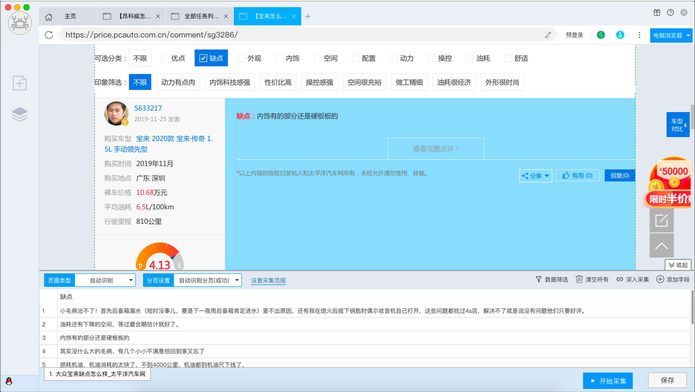

## TextCNN 太平洋汽车网汽车评论情感分析


## TextCNN模型介绍
TextCNN 是利用卷积神经网络对文本进行分类的算法，由 Yoon Kim 在 "Convolutional Neural Networks for Sentence Classification（2014）" 一文中提出.<br/>
将卷积神经网络CNN应用到文本分类任务，利用多个不同size的kernel来提取句子中的关键信息（类似于多窗口大小的ngram），从而能够更好地捕捉局部相关性。

### 论文
[Convolutional Neural Networks for Sentence Classification](https://arxiv.org/abs/1408.5882)

### 原理图


### 模型分层介绍
#### 1. 输入层
第一层为输入层。输入层是一个 __n*k__ 的矩阵，其中 n 为一个句子中的单词数， k 是每个词对应的词向量的维度。也就是说，输入层的每一行就是一个单词所对应的 k 维的词向量。<br/>
词向量使用Zhihu_QA 知乎问答训练的词向量，__预先训练的词嵌入可以利用其他语料库得到更多的先验知识__，而由当前网络训练的词向量能够更好地抓住与当前任务相关联的特征。

#### 2. 卷积层
在CV中，卷积核往往都是正方形的，比如 __3*3__ 的卷积核，然后卷积核在整张image上沿高和宽按步长移动进行卷积操作。<br/>
在NLP任务中，输入层的文本是一个由词向量拼成的词矩阵，且卷积核的宽和该词矩阵的宽相同，该宽度即为词向量大小，且卷积核只会在垂直方向移动。<br/>
__所以，卷积核和word embedding的宽度一致。__


使用多个filter_window_size（不同的kernal可以获取不同范围内词的关系，获得的是纵向的差异信息，即类似于n-gram，也就是在一个句子中不同范围的词出现会带来什么信息。比如该模型使用3,4,5个词数分别作为卷积核的大小）

#### 3. 池化层
一个卷积核对于一个sentence，卷积后得到的结果是一个vector，其shape=(sentence_len - kernal_window_size + 1, 1)，那么，在经过max-pooling操作后得到的就是一个Scalar。

使用1-max pooling，每个滑动窗口产生的特征向量中筛选出一个最重要的特征，这样每一个卷积核得到特征就是一个值，对所有卷积核使用1-max pooling，再连接起来，可以得到最终的特征向量。

#### 4. 全连接层
将经过池化后的特征向量输入全连接做分类，同时使用drop out防止过拟合。

## Bert模型介绍
2018年谷歌AI团队新发布的BERT模型，在NLP业内引起巨大反响，认为是NLP领域里程碑式的进步。BERT模型在机器阅读理解顶级水平测试SQuAD1.1中表现出惊人的成绩：全部两个衡量指标上全面超越人类，并且还在11种不同NLP测试中创出最佳成绩，包括将GLUE基准推至80.4％（绝对改进7.6％），MultiNLI准确度达到86.7%（绝对改进率5.6％）等。

BERT采用的是Transformer，并且在处理一个单词的时候，还能够考虑到该词前面的和后面的单词，得到它在上下文中的含义。ransformer的attention机制在对语境中的单词进行特征抽取时有着很好的效果，而且从直觉上看，考虑上下文的双向编码要比只考虑上文（或下文）的单向效果更好.

### 论文
[BERT: Pre-training of Deep Bidirectional Transformers for Language Understanding](https://arxiv.org/pdf/1810.04805.pdf)

### 原理图


## 数据集
使用后羿采集器爬取太平洋汽车网中车主对宝来、朗逸等汽车的点评，将优点标记为1（积极），将缺点标记为0（消极）。

[宝来汽车评论](https://price.pcauto.com.cn/comment/sg3286/)

### 爬取过程


形成spider_data.csv文件，如果句子超过40个字，则截断处理。

### 构建过程
```
import pandas as pd

data = pd.read_csv("./spider_data.csv")
data = data[['label', 'text']]
length = data.shape[0]
print(length)
print(data.head())

train = data[:int(length*0.8)]
dev = data[int(length*0.8)+1:int(length*0.9)]
test = data[int(length * 0.9)+1:]

train.to_csv("./train.tsv", sep="\t")
dev.to_csv("./dev.tsv", sep="\t")
test.to_csv("./test.tsv",sep="\t")
```
将数据集按照8:1:1的比例划分为训练集、验证集和测试集，最终形成三个tsv文件

### 数据格式
label(0 or 1), text
数据数量
| Item      | Number |
| --------- | -----: |
| train     | 56823  |
| dev       |  7102  |
| test      |  7102  |

### 数据集构建
使用正则表达式，除了中文 英文 汉字外 其他的字符都不能输入

    regex = re.compile(r'[^\u4e00-\u9fa5aA-Za-z0-9]')

使用jieba结巴分词对句子进行分词处理
```python
def word_cut(text):
    text = regex.sub(' ', text)
    return [word for word in jieba.cut(text) if word.strip()]
```

## 目录结构
```
├── 2020100457.md
├── extra
│   ├── assets
│   │   ├── bert.jpg
│   │   ├── comment1.png
│   │   ├── comment2.png
│   │   └── textcnn.png
│   ├── bert-snapshot
│   │   └── best_steps_750.pt
│   ├── pretrained
│   │   ├── bert-base-chinese
│   │   │   ├── config.json
│   │   │   ├── modelcard.json
│   │   │   ├── pytorch_model.bin
│   │   │   ├── tf_model.h5
│   │   │   └── vocab.txt
│   │   └── sgns.zhihu.word
│   └── snapshot
│       └── best_steps_700.pt
└── src
    ├── dataset
    │   ├── dev.tsv
    │   ├── mk_dataset.py
    │   ├── spider_data.csv
    │   ├── test.tsv
    │   └── train.tsv
    └── scripts
        ├── bert_main.py
        ├── bert.py
        ├── data_util.py
        ├── textcnn_dataset.py
        ├── textcnn_main.py
        ├── textcnn_model.py
        └── textcnn_train.py
```

## 系统环境
系统版本：Ubuntu 18.04.3 LTS<br/>
显卡
```
Tue Jun  9 11:22:06 2020       
+-----------------------------------------------------------------------------+
| NVIDIA-SMI 410.48                 Driver Version: 410.48                    |
|-------------------------------+----------------------+----------------------+
| GPU  Name        Persistence-M| Bus-Id        Disp.A | Volatile Uncorr. ECC |
| Fan  Temp  Perf  Pwr:Usage/Cap|         Memory-Usage | GPU-Util  Compute M. |
|===============================+======================+======================|
|   0  GeForce RTX 208...  Off  | 00000000:02:00.0 Off |                  N/A |
| 27%   27C    P8    19W / 260W |   2303MiB / 10989MiB |      0%      Default |
+-------------------------------+----------------------+----------------------+
|   1  GeForce RTX 208...  Off  | 00000000:03:00.0 Off |                  N/A |
| 27%   28C    P8    20W / 260W |     10MiB / 10989MiB |      0%      Default |
+-------------------------------+----------------------+----------------------+
|   2  GeForce RTX 208...  Off  | 00000000:82:00.0 Off |                  N/A |
| 27%   26C    P8    20W / 260W |     10MiB / 10989MiB |      0%      Default |
+-------------------------------+----------------------+----------------------+
|   3  GeForce RTX 208...  Off  | 00000000:83:00.0 Off |                  N/A |
| 27%   27C    P8     1W / 260W |     10MiB / 10989MiB |      0%      Default |
+-------------------------------+----------------------+----------------------+

```

## [BERT]用法
下载bert-base-chinese模型[bert-base-chinese](https://huggingface.co/bert-base-chinese#list-files)<br/>
下载至项目根目录的extra/pretrained文件夹下
```bash
# 开始训练
python bert_main.py
```

## [TextCNN]用法
下载预训练词向量[sgns.zhihu.word.bz2](https://pan.baidu.com/s/1VGOs0RH7DXE5vRrtw6boQA)<br/>
下载后请使用bunzip2 sgns.zhihu.word.bz2命令解压至项目根目录的extra/pretrained文件夹下
```bash
python main.py -h
```


### 依赖项
* python3.7
* pytorch==1.2.0
* torchtext==0.3.1
* jieba==0.39
* transformers==2.11.0

### [TEXTCNN]预训练词向量
使用Zhihu_QA 知乎问答训练出来的word Word2vec：https://github.com/Embedding/Chinese-Word-Vectors<br/>


### [TextCNN]训练

#### 使用CPU训练
```bash
python textcnn_main.py
```

#### 使用GPU训练
使用第一块CPU训练
```bash
python textcnn_main.py -device=0
```

### [BERT]训练
```bash
python bert_main.py
```

### [TextCNN]测试
加载模型对测试数据集进行测试准确率
```bash
cd src/scripts
python textcnn_main.py -test=true -snapshot ../../extra/snapshot/best_steps_700.pt
```
    Test- loss: 0.000018  acc: 94.0000%(6728/7102)

### [BERT]测试
加载模型对测试数据集进行测试准确率
```bash
cd src/scripts
python bert_main.py -test=true -snapshot=../../extra/bert-snapshot/best_steps_750.pt
```
    >
        Evaluation - loss: 0.001263  acc: 97.0000%(6904/7102)    


### [TextCNN]预测
输入单条语句，加载模型进行预测其情感
```bash
python textcnn_main.py -predict=true -snapshot ../../extra/snapshot/best_steps_700.pt
```
```
Loading pretrained vectors...
请输入您对汽车的评论：起步慢，发动机有顿挫感

Loading model from ./snapshot/best_steps_700.pt...

该句子的情感是: 消极

```


### 准确率
- [TextCNN]使用预训练的静态词向量
    ```bash
      python textcnn_main.py -device=0
    ```
    >
        Batch[3300] - loss: 0.002507  acc: 100.0000%(128/128)
        Evaluation - loss: 0.000022  acc: 95.0000%(6807/7102)
- [TextCNN]在测试集上的准确率
    ```bash
      python textcnn_main.py -test=true -snapshot ../../extra/snapshot/best_steps_700.pt
    ```
    >
        Test- loss: 0.000018  acc: 94.0000%(6728/7102)

-[Bert]训练
    ```bash
      python bert_main.py
    ```
    >
        Batch[750] - loss: 0.125596  acc: 93.0000%(60/64))
        Evaluation - loss: 0.140147  acc: 96.0000%(62/64) 
-[Bert]在测试集上测试的准确率
    ```bash
      python bert_main.py -test=true -snapshot=../../extra/bert-snapshot/best_steps_750.pt
    ```
    >
        Evaluation - loss: 0.001263  acc: 97.0000%(6904/7102)         

## 参考
* https://github.com/Shawn1993/cnn-text-classification-pytorch